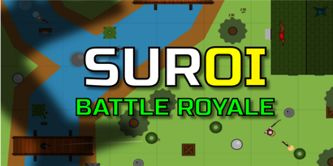

[<div align="center">
  
  <hr>
</div>


<div align="center">
  
  
  
  
  
  
  
  
</div>

## About
Suroi is an open-source 2D battle royale game inspired by [surviv.io](https://survivio.fandom.com/wiki/Surviv.io_Wiki). It is currently a work in progress.

## Play the game!
[suroi.io](https://suroi.io)

## Join the Discord!
[discord.suroi.io](https://discord.suroi.io)

## Installation and setup
Start by installing [Node.js](https://nodejs.org) and [pnpm](https://pnpm.io).

Next, [click here to download the repo](https://github.com/HasangerGames/suroi/archive/refs/heads/master.zip), or use the following command to clone it:
```sh
git clone https://github.com/HasangerGames/suroi.git
```

To install dependencies, open a terminal in the project root, and run this command:
```sh
pnpm install
```

This will create a `node_modules` directory in all three folders (`client`, `common`, and `server`) and link the packages there.

## Development
To run the game locally, open a terminal in the project root and run the following:

```sh
pnpm dev
```
To open the game, go to http://127.0.0.1:3000 in your browser.

## Production
To build for production, run this command in the project root:
```sh
pnpm build
```

To start the WebSocket server, run this command:
```sh
pnpm start
```

Production builds are served using [NGINX](https://nginx.org). A sample configuration file can be found [here](nginx.conf).

## Self-hosting
Visit [the wiki](https://github.com/HasangerGames/suroi/wiki/Self%E2%80%90hosting) for details on how to self-host.
](https://www.google.com/search?q=%3Cdiv+align%3D%22center%22%3E+%3Cimg+src%3D%22client%2Fpublic%2Fimg%2Fbackgrounds%2Fgithub_background.png%22+alt%3D%22Suroi%22%3E+%3Chr%3E+%3C%2Fdiv%3E+%23%23+Suroi16+%3Cdiv+align%3D%22center%22%3E+%3Cimg+src%3D%22https%3A%2F%2Fimg.shields.io%2Fbadge%2Fnode.js%2520-%2523339933.svg%3Fstyle%3Dfor-the-badge%26logo%3Dnodedotjs%26logoColor%3Dwhite%22%3E+%3Cimg+src%3D%22https%3A%2F%2Fimg.shields.io%2Fbadge%2Ftypescript-%25233178C6%3Fstyle%3Dfor-the-badge%26logo%3Dtypescript%26logoColor%3Dwhite%22%3E+%3Cimg+src%3D%22https%3A%2F%2Fimg.shields.io%2Fbadge%2Fpixijs%2520-%2523e22162.svg%3Fstyle%3Dfor-the-badge%22%3E+%3Cimg+src%3D%22https%3A%2F%2Fimg.shields.io%2Fbadge%2Fuwebsockets.js%2520-%2523000000.svg%3Fstyle%3Dfor-the-badge%22%3E+%3Cimg+src%3D%22https%3A%2F%2Fimg.shields.io%2Fbadge%2Fhtml-%2523E34F26%3Fstyle%3Dfor-the-badge%26logo%3Dhtml5%26logoColor%3Dwhite%22%3E+%3Cimg+src%3D%22https%3A%2F%2Fimg.shields.io%2Fbadge%2Fcss-%25231572B6%3Fstyle%3Dfor-the-badge%26logo%3Dcss3%22%3E+%3Cimg+src%3D%22https%3A%2F%2Fimg.shields.io%2Fbadge%2Fsass-%2523CC6699%3Fstyle%3Dfor-the-badge%26logo%3Dsass%26logoColor%3Dwhite%22%3E+%3Cimg+src%3D%22https%3A%2F%2Fimg.shields.io%2Fbadge%2Fvite-%25235468FF.svg%3Fstyle%3Dfor-the-badge%26logo%3Dvite%26logoColor%3Dwhite%22%3E+%3C%2Fdiv%3E+%23%23+About+Suroi+16+is+an+open+source+game+inspired+by+the+surviv.io%2C+incorporating+its+assets.+This+project+is+still+in+progress.+%23%23+How+to+Contribute%3A+Join+our+discord+server+and+contact+one+of+the+staff+%5Bsuroi16+discord+server.%5D(https%3A%2F%2Fdiscord.gg%2FJxHmKAhbmG)+%23%23+Play+the+game!+%5Bsuroi.io%5D(link+soon...)+%23%23+Join+the+Discord!+%5Bsuroi16+discord+server.%5D(https%3A%2F%2Fdiscord.gg%2FJxHmKAhbmG)+%23%23+Installation+and+setup+Start+by+installing+%5BNode.js%5D(https%3A%2F%2Fnodejs.org)+and+%5Bpnpm%5D(https%3A%2F%2Fpnpm.io).+Next%2C+%5Bclick+here+to+download+the+repo%5D(https%3A%2F%2Fgithub.com%2Fnoraaaaaaaaaaaaaaaa%2FSuroi-16.git)%2C+or+use+the+following+command+to+clone+it%3A+%60%60%60sh+git+clone+https%3A%2F%2Fgithub.com%2Fnoraaaaaaaaaaaaaaaa%2FSuroi-16.git+%60%60%60+To+install+dependencies%2C+open+a+terminal+in+the+project+root%2C+and+run+this+command%3A+%60%60%60sh+pnpm+install+%60%60%60+This+will+create+a+%60node_modules%60+directory+in+all+three+folders+(%60client%60%2C+%60common%60%2C+and+%60server%60)+and+link+the+packages+there.+%23%23+Development+To+run+the+game+locally%2C+open+a+terminal+in+the+project+root+and+run+the+following%3A+%60%60%60sh+pnpm+dev+%60%60%60+To+open+the+game%2C+go+to+http%3A%2F%2F127.0.0.1%3A3000+in+your+browser.+%23%23+Production+To+build+for+production%2C+run+this+command+in+the+project+root%3A+%60%60%60sh+pnpm+build+%60%60%60+To+start+the+WebSocket+server%2C+run+this+command%3A+%60%60%60sh+pnpm+start+%60%60%60+Production+builds+are+served+using+%5BNGINX%5D(https%3A%2F%2Fnginx.org).+A+sample+configuration+file+can+be+found+%5Bhere%5D(nginx.conf).+%23%23+Self-hosting+Visit+%5Bthe+wiki%5D(https%3A%2F%2Fgithub.com%2FHasangerGames%2Fsuroi%2Fwiki%2FSelf%25E2%2580%2590hosting)+for+details+on+how+to+self-host.&rlz=1C1RXQR_enUS1078US1078&oq=%3Cdiv+align%3D%22center%22%3E+%3Cimg+src%3D%22client%2Fpublic%2Fimg%2Fbackgrounds%2Fgithub_background.png%22+alt%3D%22Suroi%22%3E+%3Chr%3E+%3C%2Fdiv%3E+%23%23+Suroi16+%3Cdiv+align%3D%22center%22%3E+%3Cimg+src%3D%22https%3A%2F%2Fimg.shields.io%2Fbadge%2Fnode.js%2520-%2523339933.svg%3Fstyle%3Dfor-the-badge%26logo%3Dnodedotjs%26logoColor%3Dwhite%22%3E+%3Cimg+src%3D%22https%3A%2F%2Fimg.shields.io%2Fbadge%2Ftypescript-%25233178C6%3Fstyle%3Dfor-the-badge%26logo%3Dtypescript%26logoColor%3Dwhite%22%3E+%3Cimg+src%3D%22https%3A%2F%2Fimg.shields.io%2Fbadge%2Fpixijs%2520-%2523e22162.svg%3Fstyle%3Dfor-the-badge%22%3E+%3Cimg+src%3D%22https%3A%2F%2Fimg.shields.io%2Fbadge%2Fuwebsockets.js%2520-%2523000000.svg%3Fstyle%3Dfor-the-badge%22%3E+%3Cimg+src%3D%22https%3A%2F%2Fimg.shields.io%2Fbadge%2Fhtml-%2523E34F26%3Fstyle%3Dfor-the-badge%26logo%3Dhtml5%26logoColor%3Dwhite%22%3E+%3Cimg+src%3D%22https%3A%2F%2Fimg.shields.io%2Fbadge%2Fcss-%25231572B6%3Fstyle%3Dfor-the-badge%26logo%3Dcss3%22%3E+%3Cimg+src%3D%22https%3A%2F%2Fimg.shields.io%2Fbadge%2Fsass-%2523CC6699%3Fstyle%3Dfor-the-badge%26logo%3Dsass%26logoColor%3Dwhite%22%3E+%3Cimg+src%3D%22https%3A%2F%2Fimg.shields.io%2Fbadge%2Fvite-%25235468FF.svg%3Fstyle%3Dfor-the-badge%26logo%3Dvite%26logoColor%3Dwhite%22%3E+%3C%2Fdiv%3E+%23%23+About+Suroi+16+is+an+open+source+game++inspired+by+the+surviv.io%2C+incorporating+its+assets.+This+project+is+still+in+progress.+%23%23+How+to+Contribute%3A+Join+our+discord+server+and+contact+one+of+the+staff+%5Bsuroi16+discord+server.%5D(https%3A%2F%2Fdiscord.gg%2FJxHmKAhbmG)+%23%23+Play+the+game!+%5Bsuroi.io%5D(link+soon...)+%23%23+Join+the+Discord!+%5Bsuroi16+discord+server.%5D(https%3A%2F%2Fdiscord.gg%2FJxHmKAhbmG)+%23%23+Installation+and+setup+Start+by+installing+%5BNode.js%5D(https%3A%2F%2Fnodejs.org)+and+%5Bpnpm%5D(https%3A%2F%2Fpnpm.io).+Next%2C+%5Bclick+here+to+download+the+repo%5D(https%3A%2F%2Fgithub.com%2Fnoraaaaaaaaaaaaaaaa%2FSuroi-16.git)%2C+or+use+the+following+command+to+clone+it%3A+%60%60%60sh+git+clone+https%3A%2F%2Fgithub.com%2Fnoraaaaaaaaaaaaaaaa%2FSuroi-16.git+%60%60%60+To+install+dependencies%2C+open+a+terminal+in+the+project+root%2C+and+run+this+command%3A+%60%60%60sh+pnpm+install+%60%60%60+This+will+create+a+%60node_modules%60+directory+in+all+three+folders+(%60client%60%2C+%60common%60%2C+and+%60server%60)+and+link+the+packages+there.+%23%23+Development+To+run+the+game+locally%2C+open+a+terminal+in+the+project+root+and+run+the+following%3A+%60%60%60sh+pnpm+dev+%60%60%60+To+open+the+game%2C+go+to+http%3A%2F%2F127.0.0.1%3A3000+in+your+browser.+%23%23+Production+To+build+for+production%2C+run+this+command+in+the+project+root%3A+%60%60%60sh+pnpm+build+%60%60%60+To+start+the+WebSocket+server%2C+run+this+command%3A+%60%60%60sh+pnpm+start+%60%60%60+Production+builds+are+served+using+%5BNGINX%5D(https%3A%2F%2Fnginx.org).+A+sample+configuration+file+can+be+found+%5Bhere%5D(nginx.conf).+%23%23+Self-hosting+Visit+%5Bthe+wiki%5D(https%3A%2F%2Fgithub.com%2FHasangerGames%2Fsuroi%2Fwiki%2FSelf%25E2%2580%2590hosting)+for+details+on+how+to+self-host.&gs_lcrp=EgZjaHJvbWUyBggAEEUYOdIBCDI5NTdqMGo3qAIAsAIA&sourceid=chrome&ie=UTF-8)
